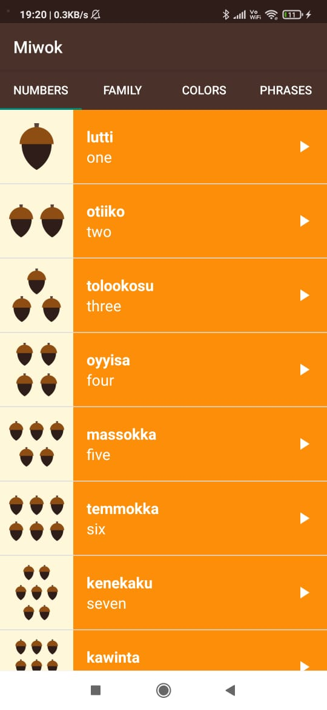
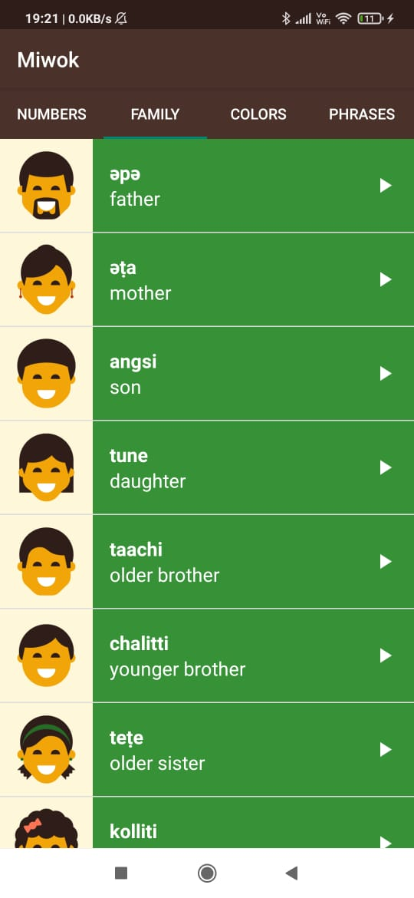
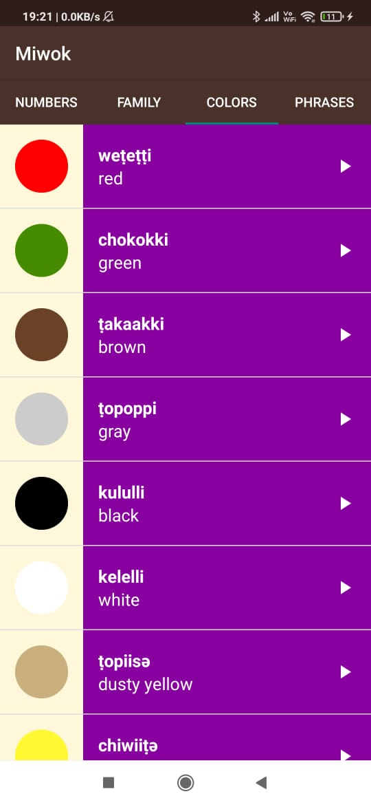

# miwok-app
Miwok is an Android application created while learning from the **Android Basics: Multiscreen Apps** course, by **Udacity**. Multiple important concepts were understood and 
implemented as a result of this project, some of which include: 
 
1. Intents and Activities
2. Activity Lifecycle
3. Best Practices for Audio Playback
4. Fragments & their Lifecycle
5. Following Material Design guidelines while adding visual polish
6. Recycling of views using ListView and a custom Adapter class
 

 &nbsp; &nbsp; 
 &nbsp; &nbsp;

